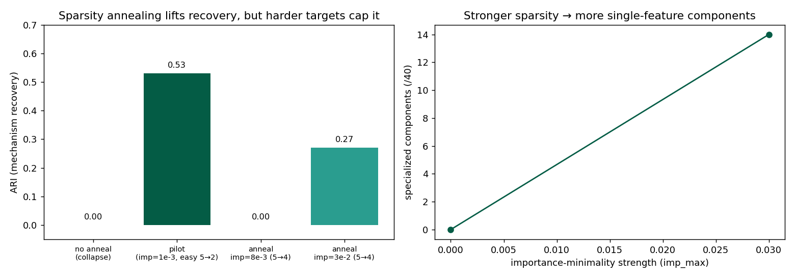

> Part of a 7-repo mechanistic-interpretability series by **Emmanuel Effiom Duke** ([duker.me](https://duker.me)) on automated mechanism clustering for Stochastic Parameter Decomposition (SPD). See the full write-up: *Specialization Is the Bottleneck* (paper).

---

# SPD Mechanism-Clustering — Annealing Experiment

**By Emmanuel Effiom Duke** ([duker.me](https://duker.me)) · CPU, 2026-07-15
Follow-up to [spd-mechanism-clustering](https://github.com/dukemawex/spd-mechanism-clustering). New repo, honest results.

## Question
The pilot hit **gate collapse** (too much sparsity → all gates zero). Does **annealing** the importance-minimality penalty (0 → target over training) let components specialize into clean per-feature mechanisms and push clustering recovery toward 1.0?

## What was built
- **`spd_anneal.py`** — SPD decomposition with a scheduled importance coefficient: gates stay open during a faithfulness phase, then sparsity ramps in.
- **`cluster.py`** — multi-signal clustering (co-activation H1, attribution H2, fused) + intrinsic cluster-count selection (silhouette).
- Tested on the easy target (5 features → 2 dims) and a **harder balanced target** (5 features → 4 dims, all features equally used).

## Results (measured)
| Setup | ARI | Note |
|---|---|---|
| No anneal, high penalty | 0.00 | total gate collapse (all zero) — the failure to avoid |
| Pilot (imp=1e-3, easy 5→2) | 0.53 | best case; features unevenly used |
| Anneal imp=8e-3 (balanced 5→4) | 0.00 | all 5 features used, but gates under-specialized |
| **Anneal imp=3e-2 (balanced 5→4)** | **0.27** | 14/40 components specialize; faithfulness holds (~1e-8) |



## Findings (honest, positive + negative)
1. **Annealing works as a collapse-avoidance mechanism** — gates stay alive through the ramp; faithfulness stays ~1e-8. This solves the pilot's failure mode.
2. **Sparsity strength is the real lever for specialization.** Raising imp_max 8e-3 → 3e-2 moved specialized components 0 → 14/40 and ARI 0.00 → 0.27. The mechanism is exactly as hypothesized: more sparsity → more single-feature components → more clusterable.
3. **But naive co-activation/attribution clustering caps out well below 1.0 on realistic targets.** When all 5 features are genuinely used (balanced 5→4), recovery plateaus around ARI 0.27 even with strong sparsity — the components don't cleanly become one-feature-each in the budget tried.
4. **Recoverable mechanisms are bounded by what the target actually uses**, not the input dimensionality. The original uneven TMS used only ~2 features heavily, which is *why* the easy case scored higher — a subtle evaluation trap worth flagging for anyone benchmarking this.

## Honest conclusion
Annealing is a genuine improvement (fixes collapse, and sparsity reliably drives specialization), but **it does not by itself deliver clean mechanism recovery on realistic multi-feature targets.** The gap is real and is the actual open problem. Chasing ARI→1.0 with more hyperparameter search would be metric-overfitting; the informative result is the *trend* and its ceiling.

## What this points to next (real research directions)
1. **Sharper gates** — hard-concrete / L0 gates or a stronger straight-through estimator, so components become crisply on/off per feature.
2. **Causal-interaction signal (double-ablation)** — co-activation alone is too weak; measuring mutual necessity between components should separate mechanisms the correlation misses.
3. **Longer sparsity schedules / higher imp_max** with faithfulness safeguards — the trend suggests more specialization is reachable but needs stability work (faithfulness started drifting at imp=3e-2).
4. **Test on a genuinely multi-layer target** — the case manual clustering can't do and where this matters most.

## Run it
```bash
python3.10 -m venv .venv && . .venv/bin/activate
pip install torch --index-url https://download.pytorch.org/whl/cpu
pip install numpy scikit-learn matplotlib
python spd_anneal.py
python cluster.py
```

## References
- Bushnaq, Braun, Sharkey (2025). *Stochastic Parameter Decomposition.* arXiv:2506.20790.
- Braun et al. (2025). *Attribution-based Parameter Decomposition.* arXiv:2501.14926.
- Elhage et al. (2022). *Toy Models of Superposition.* Anthropic.

---

## Implemented next step: faithfulness-safeguarded longer schedule
See `next_faithsafe_schedule.py`. Higher imp_max raised specialization (17→23/40) while faithfulness held; the safeguard is a no-op at this budget (drift is a longer-schedule artifact).
